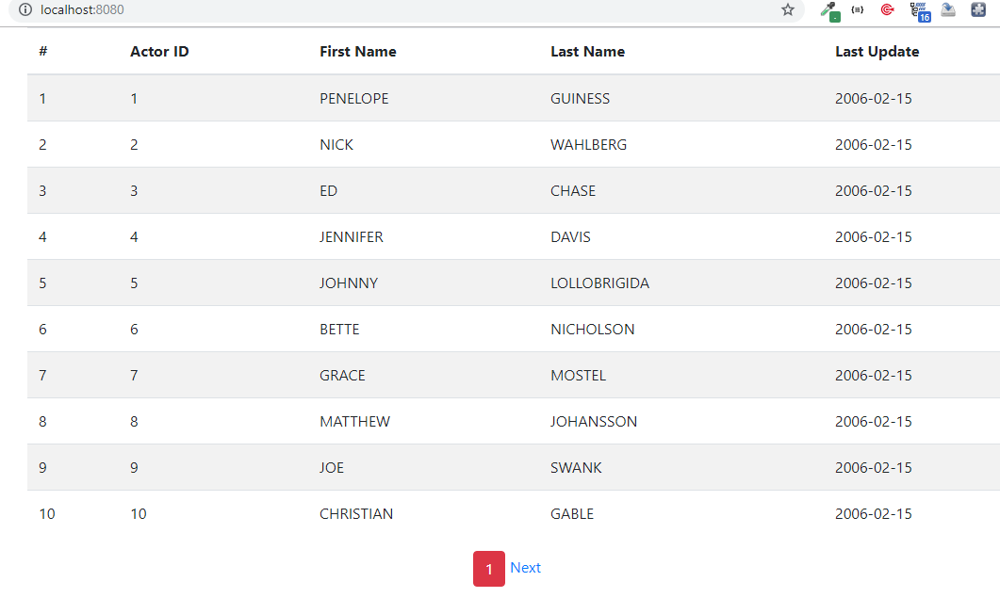
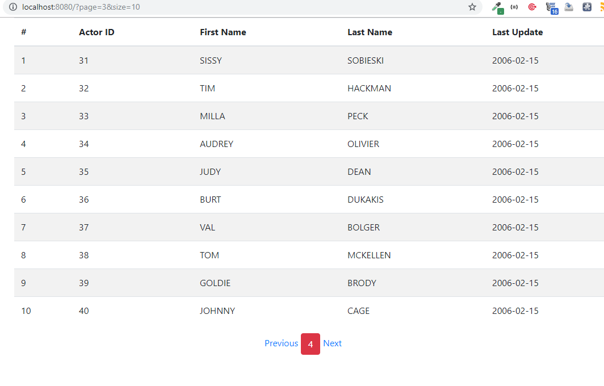

"# Spring-JPA-Pagination" 
<h3>Prerequisite</h3>

In this project i connect to mysql workbench and made use of their sakila database

I have a model class to map the actors table, load it to the page and let jpa do the pagination for me, of couse with a little tweeks

